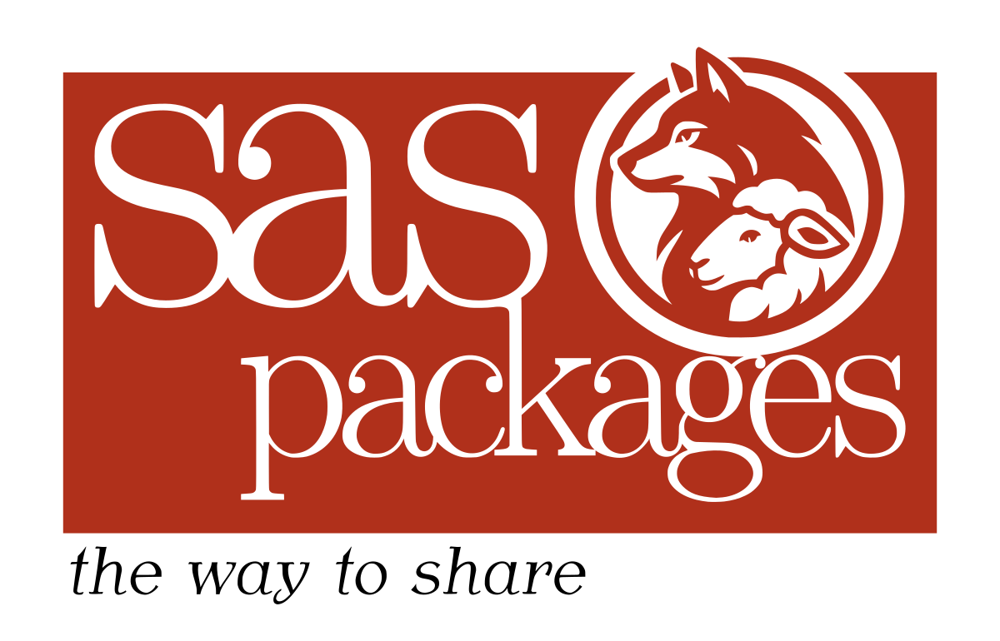

# SASPAC - SAS Packages Archive

---

### Welcome to SAS Packages Archive

Welcome to the SAS Packages Archive(`SASPAC`) repository.

The `SASPAC` repository is hosting **SAS packages** generated by [**SAS Packages Framework**](https://github.com/yabwon/SAS_PACKAGES "SAS Packages Framework").

---

### List of packages

See the [**list of currently available packages**](https://github.com/orgs/SASPAC/repositories).

---

### How to start?

If you **never used SAS packages before**, see this YouTube [video series introducing the idea and basic use cases](https://www.youtube.com/watch?v=W2Plo3i_uFQ&list=PLeMzGEImIT5eV13IGXQIgWmTFCJt_cLZG&pp=gAQB "YouTube") to learn how to start your adventure with SAS packages.
Some additional recordings from conferences and webinars are available [here](https://github.com/yabwon/SAS_PACKAGES?tab=readme-ov-file#recordings-and-presentations "Recordings from conferences and webinars").

If you are **interested in developing** a SAS package, see these [detailed tutorial materials](https://github.com/yabwon/HoW-SASPackages "Tutorial").

Before you submit a request to add your SAS package to the `SASPAC` read the [SAS Packages Archive policy](https://github.com/SASPAC/.github/blob/main/SASPAC_policy.md "SAS Packages Archive policy") to learn our rules.

---

---
